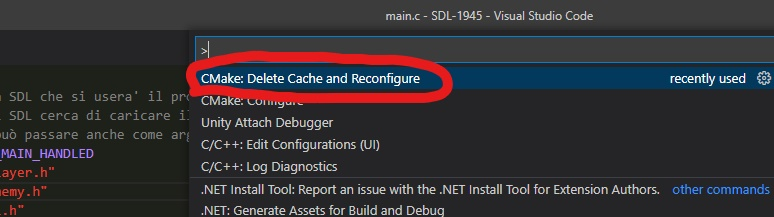
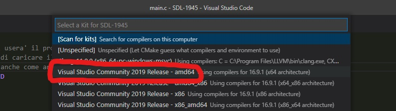
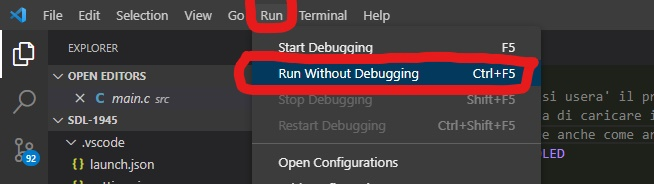

# SDL-1945
  
Top-down scroller game made to test the creation of a personal 2D engine with C(programming language), SDL2(library) and CMake(compiler).  
The game is a remake of the old videogame "<b>1945: The Final Front</b>"(upper image). Although the game is not complete and it has some soft bugs, it works properly :)  
<h2> Commands </h2>
<b> Movement: </b> WASD buttons  
<b> Shoot: </b> SpaceBar button  
<h2> Setup </h2>
Before starting the game, you need to follow these steps:  
<b> 1. </b> Open the root folder on VSCode;  
<b> 2. </b> Install CMake extensions(<b>CMake</b>/<b>CMake Tools</b>) for VSCode;  
<b> 3. </b> Press <b>Ctrl</b> + <b>Shift</b> + <b>P</b> and run "<b>CMake: Delete Cache and Reconfigure</b>" command (If asked, select "<b>amd64</b>" as kit):  

 
  
<b> 4. </b> Run the game through "<b>Run -> Run Without Debugging</b>":

  
<b> 5. </b> Enjoy!
